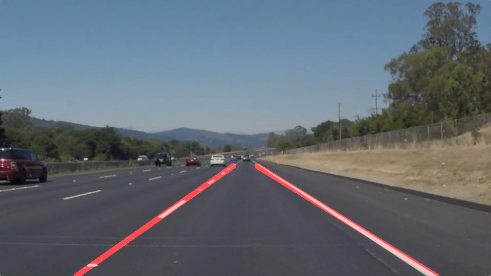

# **Finding Lane Lines on the Road** 

---

**Finding Lane Lines on the Road**

The goals / steps of this project are the following:
* Make a pipeline that finds lane lines on the road
* Reflect on your work in a written report

[//]: # (Image References)

[image1]: ./examples/grayscale.jpg "Grayscale"

---

### Reflection

### 1. Describe your pipeline. As part of the description, explain how you modified the draw_lines() function.

My pipeline consisted of 6 steps. 

First, I converted the images to grayscale.

Then I  applied gaussian blur on the image to reduce the noise.

Then I applied canny on the image to highlight the lines in the image. 

Then I isolate the region where the lanes should be by helper function of region_of_interest. 

Then I used hough transform to identify the lanes.  

After these steps, I stack the identified lines on the initial image to show the result.

In order to draw a single line on the left and right lanes, I modified the draw_lines() function by calculating the average slope, average x and average y, then I used these parametere to calculate the x coordinates on the bottom of the image as well as the x coordinates in the middle part of the image.

Then I used the vertices to draw the single lines.

The output of the pipeline is as follows: 

### 2. Identify potential shortcomings with your current pipeline

One potential shortcoming would be what would happen when there is sudden color change in the color of the road, which would lead to misleading in the identification of the lanes. This happened when I try the optional challenge. I modified the draw_line function to better adjust to this scenierio by limit the slope to certain value assuming that the lane won't dramatically change from vertical to horizontal. 

Another shortcoming could be it doesn't cope well with shadows in the middle of the road, which lies within the region of interest, hence interference the lane detecting. 

### 3. Suggest possible improvements to your pipeline

A possible improvement would be to use the color infomation to better distinguish the lanes from the shadows and others things on the road.

Another potential improvement could be to not detect lines by each frame individually. A reasonable assumption should be the lanes won't change suddenlly, thus the direction of the lanes shouldn't change dramatically.
